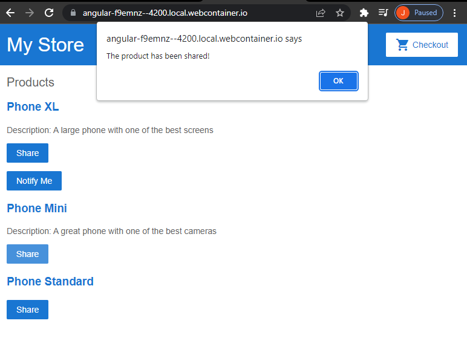
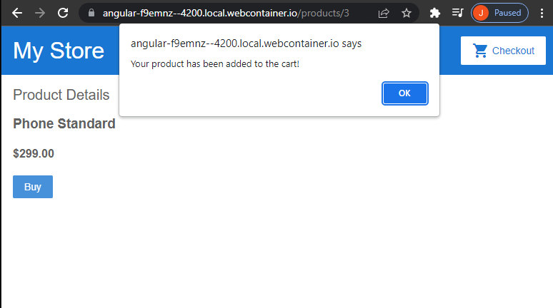
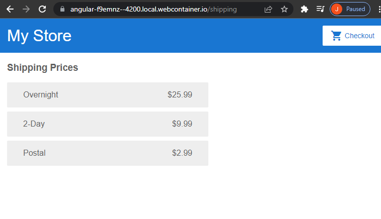
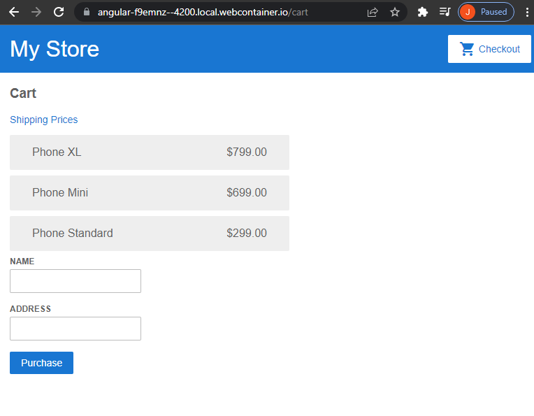

https://angular.io/start

[Edit on StackBlitz ⚡️](https://stackblitz.com/edit/angular-f9emnz)

A scalable component-based web app using HTML and an introductory to TypeScript.  Components exchange data through parent child relationships, are modified for navigation and url paths, stream data, and implement a form.  The CLI is further required to make the app locally accessible and ready for online hosting services.

